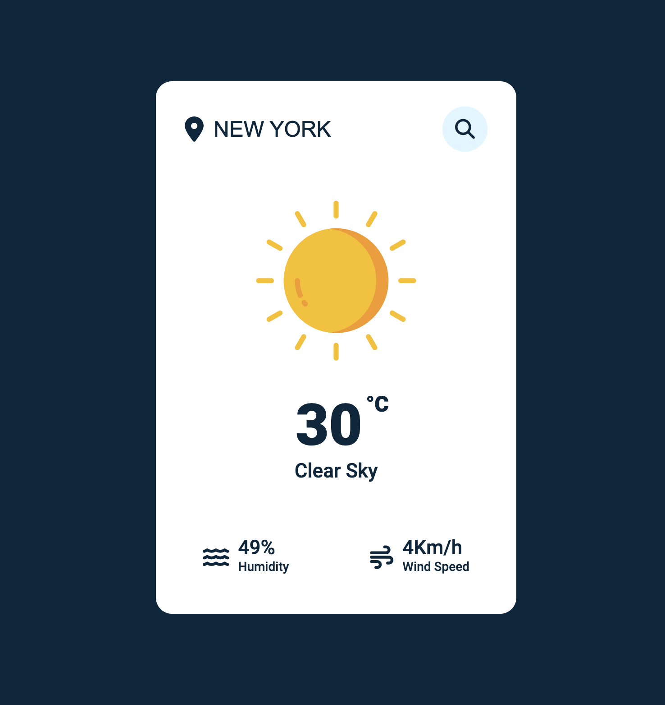

# Create your own Weather Web Application

## Warning
You need to get your own api key and replace it in index.js file on line 9 :

```javascript
const APIKey = '//Your API Key';
```

## API Key Generation
1. Go to the following link: https://openweathermap.org/
2. Sign in/ Create a new account
3. Click on your username -> My API Keys
4. Copy your private API key under 'Key'

# Screenshot
Project screenshot:


